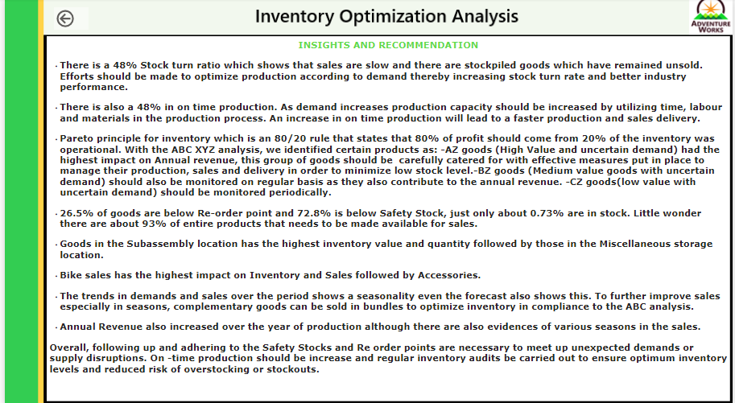

# health-care-data-analysis
This is an analysis of healthcare of people in rural areas in asaba.

## INTRODUCTION
This is a project that analyses 10000 health care data.... i used Microsift excel and jhi u  to achieve this. hi

## Problem Statement:
The goal of the analysis is to:
 - identify which products have the highest turnover rate and which have the lowest turnover rate.
 * identify the average time a product is out of stock and the frequency of stockouts.
 + classify products into high-selling, low-selling and average-selling.
- use the insights gained to make recommendations for how to optimize inventory levels and minimize stockouts which may include adjustments to reorder points, ordering certain products, or discontinuing products that are not selling well.

## Data Source
identify the average time a product is out of stock and the frequency of stockouts.classify products into high-selling, low-selling and average-selling.use the insights gained to make recom

dirty data           |      ckean dirty
:------------------: |   :-------------------------:
 |   

